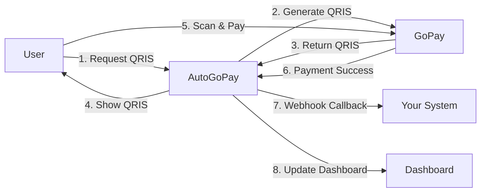
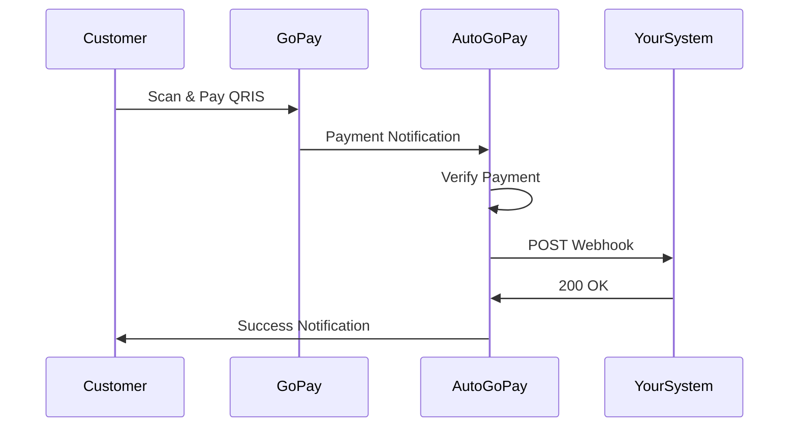

# AutoGoPay - Platform Otomasi Pembayaran GoPay QRIS

<div align="center">


**Platform otomasi pembayaran QRIS dengan API yang powerful untuk merchant Indonesia**

[](https://gopay.sawargipay.cloud)
[](https://t.me/AutoGopayBot)
[]()
[]()

</div>

---

## Tentang AutoGoPay

AutoGoPay adalah platform yang memudahkan merchant untuk menerima pembayaran GoPay secara otomatis melalui QRIS. Dengan AutoGoPay, Anda dapat:

- Generate QRIS dinamis dengan amount custom
- Cek status transaksi secara real-time
- Terima notifikasi otomatis via webhook
- Monitor semua transaksi di dashboard
- Integrasi mudah dengan sistem Anda

---

## Fitur Utama

### Generate QRIS Otomatis
Buat QRIS dinamis dengan nominal custom untuk setiap transaksi. Setiap QRIS memiliki Transaction ID unik untuk tracking yang akurat.

### Cek Status Real-time
Pantau status pembayaran secara real-time menggunakan Transaction ID. Tidak perlu khawatir dengan transaksi yang memiliki nominal sama.

### Webhook Callback
Terima notifikasi otomatis ke sistem Anda saat transaksi berhasil. Webhook dikirim secara real-time untuk update status pembayaran.

### Dashboard Monitoring
Dashboard intuitif untuk monitoring semua transaksi, statistik pendapatan, dan performa bisnis Anda.

### Keamanan & Keandalan
Data terenkripsi dengan standar industri. Kami tidak menyimpan informasi sensitif seperti password GoPay Anda.

---

## Cara Kerja



### Alur Transaksi

1. **Request QRIS** - Sistem Anda request QRIS dengan nominal tertentu
2. **Generate QRIS** - AutoGoPay generate QRIS dinamis dari GoPay
3. **Customer Bayar** - Customer scan QRIS dan bayar
4. **Notifikasi Real-time** - AutoGoPay kirim webhook ke sistem Anda
5. **Update Dashboard** - Transaksi otomatis tercatat di dashboard

---

## Cara Memulai

### 1. Registrasi Akun

Daftar akun gratis di [gopay.sawargipay.cloud](https://gopay.sawargipay.cloud/register)

- Email aktif
- Telegram ID untuk notifikasi
- Password yang kuat

### 2. Beli Activation Key

Hubungi bot Telegram [@AutoGopayBot](https://t.me/AutoGopayBot) untuk membeli Activation Key

**Paket Tersedia:**
- 1 Hari - Testing & Trial
- 7 Hari - Paket Mingguan
- 30 Hari - Paket Bulanan
- Custom - Sesuai kebutuhan

### 3. Aktivasi Akun

Login ke dashboard dan masukkan Activation Key yang sudah dibeli

### 4. Hubungkan GoPay

Hubungkan akun GoPay merchant Anda dengan aman:

- Masukkan nomor HP GoPay
- Verifikasi OTP
- Selesai! Siap terima pembayaran

### 5. Mulai Terima Pembayaran

Gunakan dashboard atau integrasikan dengan sistem Anda untuk mulai terima pembayaran otomatis

---

## Webhook Callback

AutoGoPay mengirim webhook callback ke URL yang Anda daftarkan saat transaksi berhasil.

### Format Webhook

```json
{
  "transaction_id": "TRX-1234567890",
  "amount": 50000,
  "status": "success",
  "customer_name": "John Doe",
  "payment_method": "GoPay",
  "paid_at": "2024-03-30T10:30:00Z",
  "merchant_id": "MERCHANT-123"
}
```

### Diagram Webhook Flow



### Setup Webhook

1. Login ke dashboard
2. Buka menu **Settings**
3. Masukkan **Webhook URL** Anda
4. Klik **Save**
5. Test webhook dengan tombol **Test Webhook**

---

## Use Case

### E-Commerce
Terima pembayaran otomatis untuk toko online Anda. Webhook langsung update status order.

### Donation Platform
Buat QRIS untuk donasi dengan nominal custom. Track semua donasi di dashboard.

### Subscription Service
Terima pembayaran berlangganan bulanan dengan QRIS yang mudah.

### Event Ticketing
Generate QRIS untuk setiap pembelian tiket dengan tracking yang akurat.

### Marketplace
Integrasi payment gateway untuk marketplace dengan settlement otomatis.

---

## Statistik & Monitoring

Dashboard AutoGoPay menyediakan:

- **Total Transaksi** - Jumlah transaksi hari ini, minggu ini, bulan ini
- **Total Pendapatan** - Revenue real-time dengan grafik
- **Success Rate** - Persentase transaksi berhasil
- **Response Time** - Monitoring performa sistem
- **Transaction History** - Riwayat lengkap semua transaksi
- **Search & Filter** - Cari transaksi berdasarkan ID, tanggal, status

---

## Keamanan

### Enkripsi Data
Semua data sensitif dienkripsi menggunakan standar industri (AES-256)

### No Password Storage
Kami tidak menyimpan password GoPay Anda. Koneksi langsung ke GoPay dengan token terenkripsi.

### Webhook Signature
Setiap webhook dilengkapi signature untuk verifikasi authenticity

### Rate Limiting
Proteksi dari abuse dengan rate limiting per IP dan per user

### SSL/TLS
Semua komunikasi menggunakan HTTPS dengan SSL certificate

---

## Support & Kontak

### Telegram Bot
[@AutoGopayBot](https://t.me/AutoGopayBot) - Untuk pembelian Activation Key dan support

### Website
[gopay.sawargipay.cloud](https://gopay.sawargipay.cloud)

### Support Hours
24/7 via Telegram Bot

---

## FAQ

### Berapa biaya yang dikenakan?
Registrasi gratis. Anda hanya perlu membeli Activation Key sesuai durasi penggunaan.

### Apakah data saya aman?
Ya, semua data dienkripsi dan kami tidak menyimpan informasi sensitif seperti password GoPay.

### Bagaimana cara perpanjang layanan?
via [@AutoGopayBot](https://t.me/AutoGopayBot) dan masukkan email yang terdaftar di web.

### Apakah bisa refund?
Activation Key yang sudah digunakan tidak bisa di-refund. Pastikan test dengan paket 1 hari terlebih dahulu.

### Berapa lama proses aktivasi?
Instant! Setelah memasukkan Activation Key, akun langsung aktif.

### Apakah ada limit transaksi?
Tidak ada limit transaksi. Anda bisa terima pembayaran sebanyak yang Anda mau.

### Bagaimana cara integrasi dengan website saya?
Dokumentasi lengkap tersedia di dashboard setelah login.

---

## Kenapa Memilih AutoGoPay?

| Fitur | AutoGoPay | Manual |
|-------|-----------|--------|
| Generate QRIS | Otomatis | Manual |
| Webhook Callback | Real-time | Tidak ada |
| Dashboard Monitoring | Lengkap | Tidak ada |
| Transaction Tracking | Unique ID | Sulit track |
| Response Time | <100ms | Lambat |
| Support | 24/7 | Terbatas |

---

## Terms of Service

Dengan menggunakan AutoGoPay, Anda setuju dengan [Terms of Service](https://gopay.sawargipay.cloud/terms) kami.

---

## Siap Memulai?

<div align="center">

### [Daftar Sekarang](https://gopay.sawargipay.cloud/register)

**Registrasi gratis • Setup 5 menit • Support 24/7**

---

Made by AutoGoPay Team

© 2026 AutoGoPay. All rights reserved.

</div>
